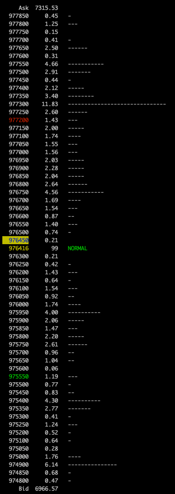

gorderbook
==========

gorderbook is tool to monitor bitFlyer's board(order book).

gorderbook monitor the bitflyer's board. You can display grouped price and size.

## Usage

    Usage of ./gorderbook:
      -group int
            grouping price on board. (default 1)

